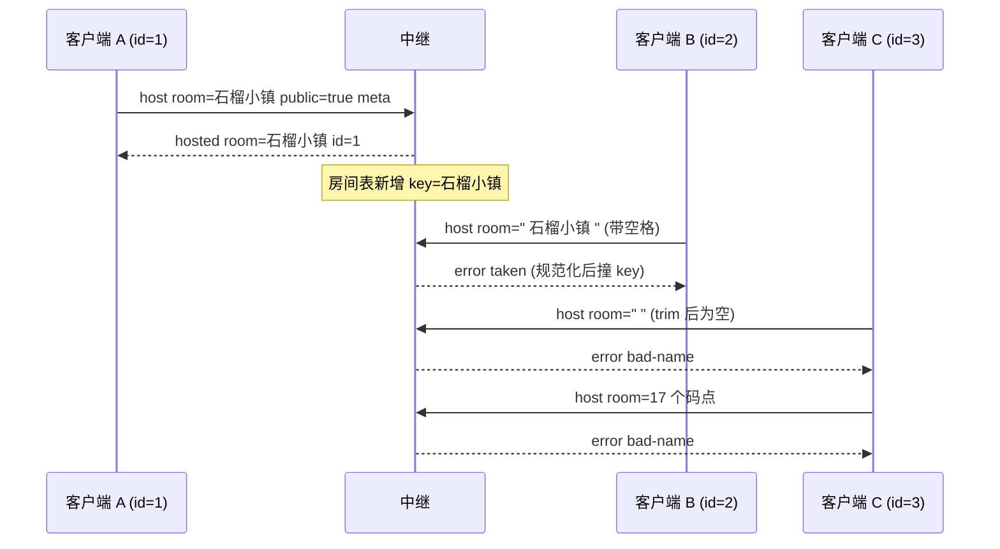

# 场景 01:建房 —— 成功 / 房名被占 / 非法房名

一个连接发送 `{t:'host', room, public?, meta?}` 申请创建以**房间名**为身份的房间,并成为房主。
房间名规范化、查重、长度校验全部由中继完成(`server/index.js` 的 `normalizeRoomName`):

- `String(room).normalize('NFC').trim()`,再把内部连续空白折叠为单个空格;
- 规范化后必须是 **1–16 个 Unicode 码点**(按码点计数,不是 UTF-16 单元),否则 `bad-name`;
- 查重 key = 规范化名 `.toLowerCase()`;对外显示名 = 创建者输入的规范化形态。

## 时序图



## 逐条消息

### 1. 建房成功

客户端 A → 中继:

```json
{"t":"host","room":"石榴小镇","public":true,"meta":{"n":"阿石"}}
```

中继 → 客户端 A(A 自此绑定为该房间的房主):

```json
{"t":"hosted","room":"石榴小镇","id":1}
```

- `room` 回显的是规范化后的显示名;`id` 是中继分配给本连接的整数 id。
- `public` 默认 `true`,只有字面 `false` 才创建私密房(代码为 `msg.public !== false`)。
- `meta` 是中继**不解析**的不透明 JSON,原样存储并在房间列表里回显;
  若其 JSON 序列化超过 256 字符则存为 `null`。客户端约定 `meta = {n: 房主名(≤24 字符)}`
  (`public/js/main.js` 的 `createRoom`)。

### 2. 房名被占(taken)

客户端 B → 中继(名字前后带空格,规范化后与已有房间同 key):

```json
{"t":"host","room":" 石榴小镇 "}
```

中继 → 客户端 B:

```json
{"t":"error","code":"taken"}
```

`tools/relay-test.js` 还断言了 ASCII 名的折叠与大小写不敏感:
`'  Sky   Land '` 创建出的显示名为 `'Sky Land'`,且 `'sKY lAND'` 能加入同一房间。

### 3. 非法房名(bad-name)

客户端 C → 中继(trim 后为空):

```json
{"t":"host","room":"   "}
```

中继 → 客户端 C:

```json
{"t":"error","code":"bad-name"}
```

客户端 C → 中继(17 个码点,超出上限 16):

```json
{"t":"host","room":"一二三四五六七八九十一二三四五六七"}
```

中继 → 客户端 C:

```json
{"t":"error","code":"bad-name"}
```

长度按**码点**计:`tools/relay-test.js` 断言 16 个 emoji(32 个 UTF-16 单元)是合法房名。

## 客户端侧的后续(find-first 流程)

`public/js/main.js` 的菜单流程是"先找后建":玩家输入房间名先尝试 `join`,
收到 `no-room` 才弹出创建确认;创建时若收到 `taken`(创建竞速输了,房间刚被别人建出),
客户端自动改发 `join` 加入该房间,而不是报错。

## 信任边界要点

- **中继校验**:房名规范化与 1–16 码点长度、key 查重、meta 序列化 ≤256 字符,
  全部在服务器端执行;客户端发什么都不能绕过(`network.js` 刻意只 trim、不做规范化)。
- **中继不校验**:`meta` 内容(不透明字节,攻击者可控,见场景 03)、`d` 字段(根本不存在于 host 消息)。
- 已绑定的连接(已是房主或成员)再发 `host`/`join` 会被**静默忽略**(`if (st.role) return`),
  不报错——一个连接一生只能绑定一个房间一个角色。
- 畸形 JSON、缺 `t` 字段、未知 `t` 一律静默丢弃;入站帧超过 64 KB 由 ws 以 1009 关闭连接。
- 错误码全集就是 `bad-name` / `taken` / `no-room` / `full`,客户端按
  `public/js/main.js` 的 `errorText` 映射成中文提示。
