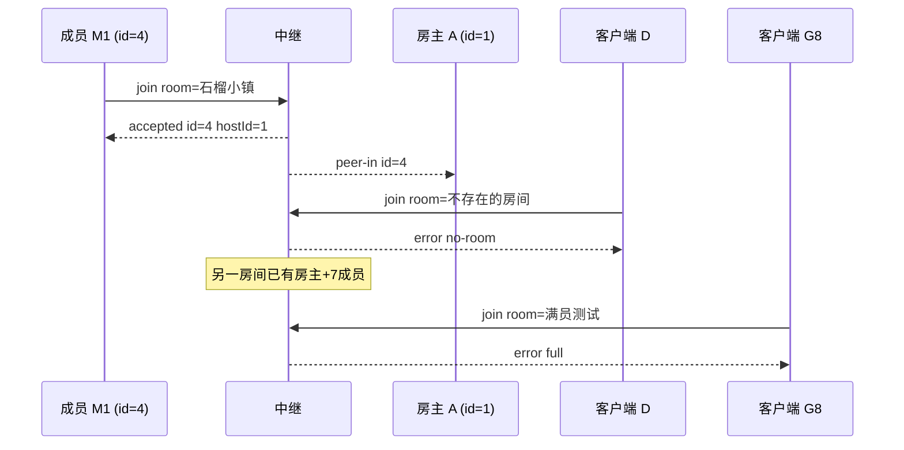

# 场景 02:加入房间 —— 成功 / 房间不存在 / 满员

未绑定的连接发送 `{t:'join', room}` 按名字加入房间。房名走与建房完全相同的规范化
(NFC + trim + 空白折叠 + key 小写,1–16 码点,见场景 01),所以 `' 石榴小镇 '`、
大小写不同的 ASCII 名都能命中同一房间。

房间容量:**8 个连接(房主 + 7 名成员)**,即 `server/index.js` 的
`ROOM_CAPACITY = 8`,成员数已达 7 时再来的 `join` 收到 `full`。

## 时序图



## 逐条消息

### 1. 加入成功

成员 M1 → 中继:

```json
{"t":"join","room":"石榴小镇"}
```

中继 → 成员 M1(M1 自此绑定为该房间成员):

```json
{"t":"accepted","id":4,"hostId":1}
```

中继 → 房主 A(同时通知房主有新连接进房):

```json
{"t":"peer-in","id":4}
```

- `id` 是中继分配给 M1 的连接 id,`hostId` 是当前房主的连接 id。
- `accepted` 只代表**进入了中继房间**;游戏层身份要等成员发 `hello`、
  房主回 `joined` 才算建立(见场景 04)。房主端此时把 id=4 登记为
  "pending(未 hello)"成员(`public/js/host.js` 的 `handlePeerIn`)。

### 2. 房间不存在(no-room)

客户端 D → 中继:

```json
{"t":"join","room":"不存在的房间"}
```

中继 → 客户端 D:

```json
{"t":"error","code":"no-room"}
```

在 `public/js/main.js` 的 find-first 流程里,`no-room` 不是失败而是预期分支:
菜单据此弹出"没有找到「xx」→ 创建这个房间"的确认框。

### 3. 满员(full)

前置:房间「满员测试」已有房主(id=10)和 7 名成员(id=11…17),实测第 7 名成员
仍被 `accepted`。第 8 名申请者:

客户端 G8 → 中继:

```json
{"t":"join","room":"满员测试"}
```

中继 → 客户端 G8:

```json
{"t":"error","code":"full"}
```

空房名的 `join` 同样收到 `bad-name`(与建房共用同一套校验):

```json
{"t":"join","room":""}
```

```json
{"t":"error","code":"bad-name"}
```

## 信任边界要点

- **id 由中继分配**,客户端无法自选或伪造;后续所有游戏层消息的 `from` 也由中继
  按连接盖章(见场景 09),成员身份不可冒充。
- 容量检查在中继执行(`room.members.size >= ROOM_CAPACITY - 1`),恶意客户端
  无法挤进满员房间。
- 已绑定的连接再发 `join` 被静默忽略(`if (st.role) return`)。
- `accepted` 里的 `hostId` 只是信息;成员发消息时**不需要也不能**指定目标,
  中继自动路由到当前房主(房主迁移后自动指向新房主,见场景 07)。
- 客户端防卡死:`main.js` 给每个等待中继回复的请求设了约 10 秒期限
  (`armReplyTimer`),房主收下了 `peer-in` 却永不回 `joined` 时,成员会主动断开重置菜单。
