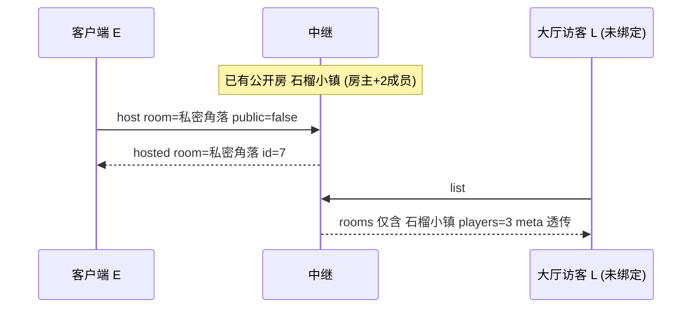

# 场景 03:大厅 —— `list` → `rooms`

任何连接(包括从未 `host`/`join` 的"未绑定"连接)都可以发送 `{t:'list'}` 获取公开房间列表。
中继的回复规则(`server/index.js` 的 `list` 分支):

- **只列公开房**(`public: true` 的房间);
- `players = members.size + 1`(成员数 + 房主);
- 按创建时间**新房在前**排序;
- 最多 **50** 条;
- `meta` 原样回显(中继从不解析)。

## 时序图



## 逐条消息

前置:公开房「石榴小镇」此刻有房主 A 和两名已加入的成员(M1、M2)。
另一个客户端 E 创建了一个**私密**房:

客户端 E → 中继:

```json
{"t":"host","room":"私密角落","public":false,"meta":{"n":"私房主"}}
```

中继 → 客户端 E:

```json
{"t":"hosted","room":"私密角落","id":7}
```

大厅访客 L(未绑定连接)→ 中继:

```json
{"t":"list"}
```

中继 → 大厅访客 L:

```json
{"t":"rooms","rooms":[{"room":"石榴小镇","players":3,"meta":{"n":"阿石"}}]}
```

注意:

- 「私密角落」**没有出现**在列表里(`public:false`),但知道名字的人仍可直接 `join` 它;
- `players: 3` = 房主 + 2 名成员,计的是**中继连接数**,与游戏层是否已 `hello` 无关;
- `meta` 是建房时传入的 `{"n":"阿石"}` 原样透传——客户端约定在 `meta` 里放
  `{n: 房主名}`(见 `DESIGN.md` 的 meta 约定),中继原样透传;但**当前版本的大厅
  UI 并不读取/显示 `meta`**(预留字段):`public/js/main.js` 的 `onRooms` 在渲染前
  只保留 `room` 与 `players`,房间行只显示房名与人数。

## 客户端侧的用法

`public/js/main.js` 启动时自动连接服务器并 `listRooms()`,刷新按钮与
菜单返回时也会重新拉取;约 10 秒没等到 `rooms` 视为半开连接,标记断线
(`armLobbyTimer`)。收到 `rooms` 后只取 `room` 与 `players` 字段渲染
(`onRooms` 里先过滤掉非对象的条目)。

## 信任边界要点

- **meta 是攻击者可控的不透明字节**:服务器地址由用户填写,任何人都能搭中继,
  所以客户端把列表条目当不可信输入——`main.js` 的 `onRooms` 先
  `filter((r) => r && typeof r === 'object')`,UI 渲染只用 `textContent`
  (不可能注入 HTML),容忍任意形状。
- 中继对 meta 的唯一约束是大小(序列化 >256 字符 → 存 `null`),内容完全不看。
- `list` 不需要任何身份,是无成本的公开接口;输出被硬性截到 50 条,
  房间再多也不会放大响应体。
- 私密房的"私密"只是**不出现在列表**,不是访问控制——房名即门票,
  能猜中名字就能加入。
