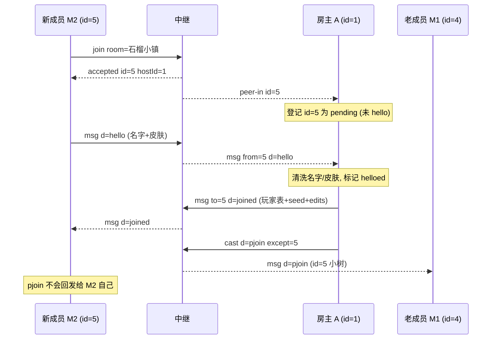

# 场景 04:入房握手 —— `hello` → `joined` + `pjoin` 广播

`accepted` 只是进了中继房间;游戏层身份由这次握手建立。流程
(成员端 `public/js/main.js` 的 `onAccepted` / 房主端 `public/js/host.js` 的 `handleMsg`):

1. 成员收到 `accepted` 后立刻向房主发 `hello`,带自己的名字和皮肤;
2. 房主清洗名字与皮肤,把该成员标记为已 hello,**单播** `joined`
   (含房名、世界种子、完整玩家表、全量修改集 edits);
3. 房主同时向**其他**成员广播 `pjoin`(`cast` 带 `except` 排除新人自己)。

皮肤 `skin = {s, p}` 是 `public/js/constants.js` 中 `PALETTE`(8 色)的索引,
合法范围 0–7 的整数,否则坍缩为 `{s:0, p:0}`。

## 时序图



## 逐条消息

(抓取时房间内已有房主 阿石(id=1)和成员 小梅(id=4),新成员 小树(id=5)加入。)

新成员 M2 → 中继(`join`/`accepted`/`peer-in` 三帧同场景 02,略)。

新成员 M2 → 中继(收到 `accepted` 后立即):

```json
{"t":"msg","d":{"t":"hello","name":"小树","skin":{"s":3,"p":0}}}
```

中继 → 房主 A(盖上 `from` 后转发):

```json
{"t":"msg","from":5,"d":{"t":"hello","name":"小树","skin":{"s":3,"p":0}}}
```

房主 A → 中继(单播 `joined` 给新人):

```json
{"t":"msg","to":5,"d":{"t":"joined","room":"石榴小镇","seed":12345,"id":5,"players":[{"id":1,"name":"阿石","p":[8.5,33,8.5],"ry":0,"skin":{"s":1,"p":5}},{"id":4,"name":"小梅","p":[8,40,8],"ry":0,"skin":{"s":2,"p":6}}],"edits":[]}}
```

中继 → 新成员 M2(去掉 `to` 信封,只剩 `d`):

```json
{"t":"msg","d":{"t":"joined","room":"石榴小镇","seed":12345,"id":5,"players":[{"id":1,"name":"阿石","p":[8.5,33,8.5],"ry":0,"skin":{"s":1,"p":5}},{"id":4,"name":"小梅","p":[8,40,8],"ry":0,"skin":{"s":2,"p":6}}],"edits":[]}}
```

`joined` 字段语义(`public/js/host.js` 的 `buildJoined`):

- `id`:接收者自己的中继 id;`seed`:世界种子(世界 = 种子 + 修改集,新人本地生成同样地形);
- `players`:**含房主自己、不含接收者**,且只含已 hello 的成员;房主的位置取自实时
  句柄(`playerRef`),不是快照;尚未发过 `move` 的成员显示在名义出生点 `[8,40,8]`;
- `edits`:房主 `world.edits` 的全量序列化 `[[x,y,z,id],...]`(此刻还没有人改过方块,为空)。

房主 A → 中继(向其他成员广播新人,`except` 排除新人自己):

```json
{"t":"cast","d":{"t":"pjoin","id":5,"name":"小树","p":[8,40,8],"ry":0,"skin":{"s":3,"p":0}},"except":5}
```

中继 → 老成员 M1:

```json
{"t":"msg","d":{"t":"pjoin","id":5,"name":"小树","p":[8,40,8],"ry":0,"skin":{"s":3,"p":0}}}
```

实测 M2 自己在 600ms 内未收到任何回声——`except` 生效。

### 重复 hello

同一成员再次发 `hello`(典型场景:房主迁移后的无条件重发,见场景 07),房主**只重新
单播 `joined`**,绝不重复 `pjoin` 广播(实测其他成员无任何感知)。

## 信任边界要点

- **房主端清洗一切成员输入**(`host.js` 的 `cleanName`/`cleanSkin`):
  名字 trim 后截到 16 字符、空名回退为 `玩家`;皮肤必须是 0–7 整数对,否则 `{s:0,p:0}`。
  未收到 `peer-in` 登记的 id、或 hello 之前的 `move`/`block`,一律忽略。
- **成员端反向校验 `joined`**(`main.js` 的 `memberOnMsg`):房主只是另一个玩家的浏览器,
  同样不可信——`room` 必须是 1–16 码点字符串、每个 `players[i].p` 必须是 3 个有限数、
  `edits` 逐条过滤非法项;畸形 `joined` 直接丢弃(靠加入超时回到菜单),
  绝不在隐藏菜单后崩溃。重复的 `joined` 帧被 `startGame` 的 playing 守卫忽略,
  不会叠加第二个游戏会话。
- 中继对这一切**零参与**:`d` 不透明转发,`from` 由中继按连接盖章(成员伪造不了),
  发往成员的信封里没有 `from` 字段。
