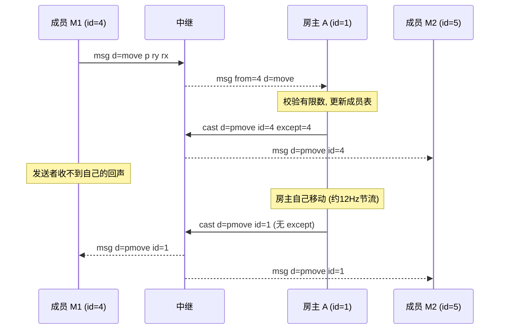

# 场景 05:移动同步 —— `move` → `pmove`(except 发送者)

成员把自己的脚底位置/朝向发给房主,房主验证后以 `pmove` 广播给**除发送者外**的所有成员;
房主自己的移动也走 `pmove`(盖自己的 id,无 except)。发送频率由发送方节流到约 12 Hz
(`public/js/main.js` 的 `MOVE_INTERVAL = 1000 / 12`)。

字段:`p = [x, y, z]` 脚底位置,`ry` 偏航(yaw),`rx` 俯仰(pitch),均为有限数。

## 时序图



## 逐条消息

### 1. 成员移动

成员 M1 → 中继:

```json
{"t":"msg","d":{"t":"move","p":[10.2,33,9.1],"ry":1.57,"rx":-0.2}}
```

中继 → 房主 A:

```json
{"t":"msg","from":4,"d":{"t":"move","p":[10.2,33,9.1],"ry":1.57,"rx":-0.2}}
```

房主 A → 中继(转播,`except` 抑制回声):

```json
{"t":"cast","d":{"t":"pmove","id":4,"p":[10.2,33,9.1],"ry":1.57,"rx":-0.2},"except":4}
```

中继 → 成员 M2:

```json
{"t":"msg","d":{"t":"pmove","id":4,"p":[10.2,33,9.1],"ry":1.57,"rx":-0.2}}
```

实测发送者 M1 在 600ms 内未收到任何回声——位置以本地预测为准、自然自愈,
不需要权威回显(对比场景 06 的 `block`,那里刻意**不**排除发送者)。

### 2. 房主自己的移动

房主不经过中继转发(它就是权威),直接广播、盖自己的 id、不带 `except`
(`public/js/host.js` 的 `castOwnMove`):

房主 A → 中继:

```json
{"t":"cast","d":{"t":"pmove","id":1,"p":[9,33,8],"ry":0.5,"rx":0}}
```

中继 → 成员 M1 与 成员 M2(同一份载荷,中继按成员逐个下发):

```json
{"t":"msg","d":{"t":"pmove","id":1,"p":[9,33,8],"ry":0.5,"rx":0}}
```

## 信任边界要点

- **房主端校验形态**(`host.js` 的 `move` 分支):`p` 必须是长度 3 的有限数数组,
  `ry`/`rx` 必须是有限数(挡住 `NaN`/`Infinity`/类型混淆),hello 之前的 move 忽略;
  校验通过才更新成员表(供 `joined` 玩家表使用)并转播。
- **房主不校验运动合理性**:只看数值形态,不看位移距离——改装客户端可以瞬移。
  这是 v2 接受的信任模型(房主是玩家浏览器,本就不是反作弊节点)。
- **成员端再校验 `pmove`**(`main.js` 的 `memberOnMsg`):`p` 不合法直接丢弃;
  `ry` 非有限数替换为 0——渲染器对角度做增量插值,一个 `NaN` 会**永久**毒化
  该化身的变换矩阵,所以这层防御不能省。
- 中继全程不解析 `d`,只认信封:`from` 盖章、`cast` 仅房主可用、`except` 仅用于
  回声抑制(目标已离房则照常全员广播,见 `server/index.js` 的 `cast` 分支注释)。
