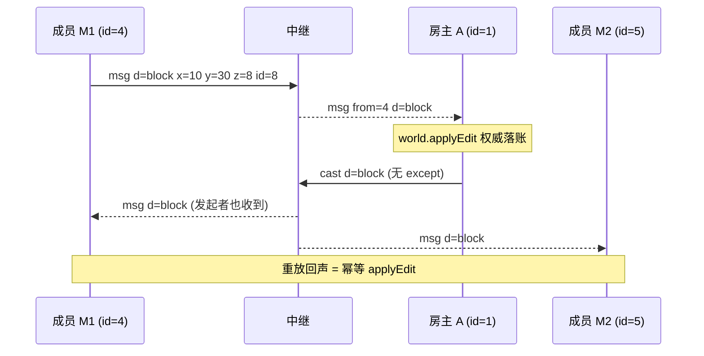

# 场景 06:放块收敛 —— `block` 全员回声(含发起者)、幂等重放

方块编辑是唯一**不排除发送者**的广播。成员发 `{t:'block', x, y, z, id}`(`id=0` 表示破坏),
房主先把它写进自己的权威世界(`world.applyEdit`),再把权威结果 `cast` 给**全部成员,
包括发起者本人**(`public/js/host.js` 的 `block` 分支与 `castOwnBlock`,均无 `except`)。

为什么含发起者:房主是权威。两名成员几乎同时改同一格时,所有人(含两位发起者)
最终都按**房主收到的顺序**重放这两条回声,同格冲突收敛到同一个结果而不是各执一词。
发起者重放自己那条回声是幂等的(同格同 id 再写一次,世界不变)。
`pmove` 不需要这一招——位置流式更新会自愈,所以它保留 `except` 省一条回声。

## 时序图



## 逐条消息

成员 M1 → 中继(在 (10,30,8) 放一块砖,id=8 是 `constants.js` 里的 `BLOCK.BRICK`):

```json
{"t":"msg","d":{"t":"block","x":10,"y":30,"z":8,"id":8}}
```

中继 → 房主 A:

```json
{"t":"msg","from":4,"d":{"t":"block","x":10,"y":30,"z":8,"id":8}}
```

房主 A → 中继(注意:**没有 `except`**):

```json
{"t":"cast","d":{"t":"block","x":10,"y":30,"z":8,"id":8}}
```

中继 → 成员 M1 与 成员 M2(两人都收到,含发起者 M1):

```json
{"t":"msg","d":{"t":"block","x":10,"y":30,"z":8,"id":8}}
```

### 幂等重放

同一成员把**完全相同**的编辑再发一次,整条链路原样重演:房主再次 `applyEdit`
(同格同值,无副作用)、再次全员回声,实测两次回声逐字节一致。这保证了
重发、重放、迁移后 `resync`(见场景 07)都不会破坏世界一致性。

这次编辑从此进入房主的 `world.edits`,后续所有 `joined.edits` 与 `resync.edits`
都会带上 `[10,30,8,8]`(场景 07 / 09 的抓取可对照)。

## 信任边界要点

- **房主端校验**(`host.js` 的 `block` 分支):`x/y/z/id` 必须是整数,
  `0 <= id <= 8`(上限由 `BLOCK` 表派生的 `MAX_BLOCK_ID`,新增方块自动跟进),
  `0 <= y < 64`(`HEIGHT`);hello 之前的 block 忽略。非法编辑静默丢弃,
  绝不进入权威修改集。
- **成员端镜像同一套校验**(`main.js` 的 `block` 分支):恶意房主广播的越界编辑
  (NaN 坐标、超界 id)若不拦截,会污染成员**自己的**权威修改集,并在该成员日后
  被提升为房主时扩散到全房——所以收到方也要验。
- **"y=0 层不可破坏"只是诚实客户端的 UI 规则**(`main.js` 的 `doBreak` 不发
  y≤0 的破坏),房主端校验允许 `y=0` 的编辑——改装客户端可以挖穿底层。
  与移动一样,这是 v2 接受的信任模型。
- 中继不解析 `d`:它不知道这是方块编辑,只是把 `cast` 信封拆开逐成员转发。
