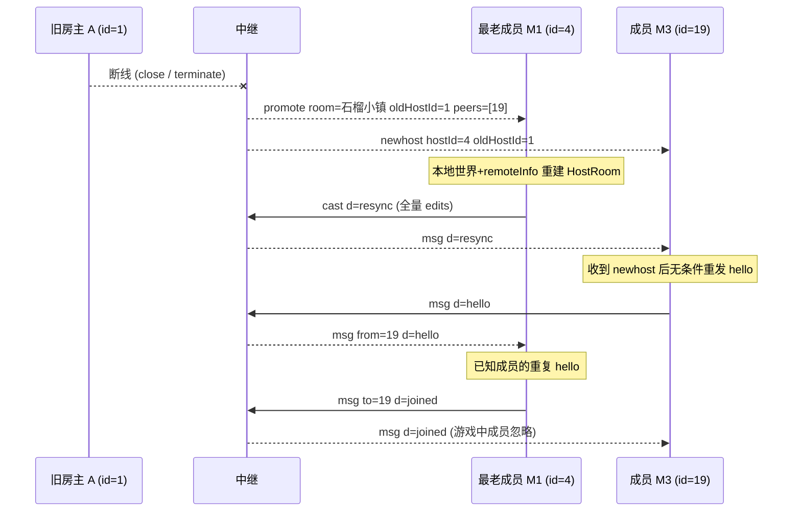

# 场景 07:房主迁移 —— `promote` + `newhost` → 重发 `hello` → `resync`

房主断线但房间还有成员时,中继**不解散房间**,而是提升**最老的成员**
(成员 Map 的插入顺序即加入顺序)为新房主,房间名不变(`server/index.js` 的 close 处理):

- 给被提升者发 `{t:'promote', room, oldHostId, peers:[其余成员 id]}`,
  其连接角色已先行翻成 host;
- 给其余成员广播 `{t:'newhost', hostId, oldHostId}`;
- 若没有成员剩下,直接删房。

迁移之所以廉价:**世界 = 种子 + 修改集,每个客户端都持有全量**,新房主用本地状态
即可重建权威(`public/js/main.js` 的 `handlePromote`)。

## 时序图



## 逐条消息

前置:房间「石榴小镇」内有旧房主 阿石(id=1)、成员 小梅(id=4,最早加入)、
成员 阿迁(id=19),且世界已有一条编辑 `[10,30,8,8]`(场景 06)。
旧房主连接关闭(主动退出、崩溃或心跳清扫,见场景 10,中继一视同仁)。

中继 → 成员 M1(被提升者;`peers` 是**其余**成员的 id 列表,不含 M1 自己):

```json
{"t":"promote","room":"石榴小镇","oldHostId":1,"peers":[19]}
```

中继 → 成员 M3(其余成员收到广播):

```json
{"t":"newhost","hostId":4,"oldHostId":1}
```

新房主 M1 → 中继(`handlePromote` 立即用本地修改集广播 `resync`,
让所有幸存成员收敛到新权威的世界):

```json
{"t":"cast","d":{"t":"resync","edits":[[10,30,8,8]]}}
```

中继 → 成员 M3:

```json
{"t":"msg","d":{"t":"resync","edits":[[10,30,8,8]]}}
```

成员 M3 → 中继(收到 `newhost` 后**无条件**重发 `hello`——中继此时已把
"发往房主"的路由指向 M1,成员代码无需任何改动):

```json
{"t":"msg","d":{"t":"hello","name":"阿迁","skin":{"s":7,"p":4}}}
```

中继 → 新房主 M1:

```json
{"t":"msg","from":19,"d":{"t":"hello","name":"阿迁","skin":{"s":7,"p":4}}}
```

新房主 M1 → 中继(M3 已在接管名单里,属于重复 hello → 仅重新单播 `joined`,
不再广播 `pjoin`;玩家表此刻只剩新房主自己):

```json
{"t":"msg","to":19,"d":{"t":"joined","room":"石榴小镇","seed":12345,"id":19,"players":[{"id":4,"name":"小梅","p":[10.2,33,9.1],"ry":1.57,"skin":{"s":2,"p":6}}],"edits":[[10,30,8,8]]}}
```

中继 → 成员 M3(已在游戏中的成员忽略这份重复 `joined`):

```json
{"t":"msg","d":{"t":"joined","room":"石榴小镇","seed":12345,"id":19,"players":[{"id":4,"name":"小梅","p":[10.2,33,9.1],"ry":1.57,"skin":{"s":2,"p":6}}],"edits":[[10,30,8,8]]}}
```

### 为什么 hello 要无条件重发(`main.js` 的 `handleNewHost`)

两个竞态窗口都靠它闭合:(a) 成员刚加入、初始 `hello` 随旧房主一起死了,
`joined` 永远不会来——重发才能完成入房;(b) 成员已在游戏中,但新房主从未见过
它的 hello(死在旧房主那边),在新房主眼里它是"幽灵成员"——重发让新房主
补播 `pjoin`。已认识的成员重发只换来一份被忽略的 `joined`,无害(幂等)。

### 接受的边界情况

被提升者若还没收到过 `joined`(没有世界可当权威),它主动断开,
中继随即提升下一名成员(`handlePromote` 的无 world 分支;
`tools/member-bot.js` 收到 `promote` 也是这么做的)。

## 信任边界要点

- **`peers` 列表以中继为准**:新房主把本地 `remoteInfo` 过滤到 `peers` 再接管
  (`adoptMembers`);本地记着但不在 `peers` 里的玩家是死亡窗口里悄悄离开的
  (其 `pleave` 丢了)——新房主替它们补播 `pleave`,全房同步剔除。
- **接管的数据再清洗一遍**:`adoptMembers` 对继承的名字/皮肤重跑
  `cleanName`/`cleanSkin`——恶意旧房主塞进 `pjoin` 的毒名字不能借
  `buildJoined` 二次扩散。
- **成员逐条校验 `resync.edits`**(`main.js` 的 `resync` 分支):整数、
  `0 <= y < 64`、`0 <= id <= 8`,非法条目跳过——与 `joined.edits`/`block`
  同一套过滤,恶意新房主无法污染本地权威修改集。
- 死亡窗口内、新房主没见过的编辑会被 `resync` **覆盖丢弃**——房主状态获胜,
  这正是后来加入者将看到的世界(设计取舍,见 `DESIGN.md`)。
- 中继侧的陈旧 close 有守卫(`room.host !== ws` 检查),迁移后旧房主连接
  迟到的关闭事件不会再触发一次迁移。
