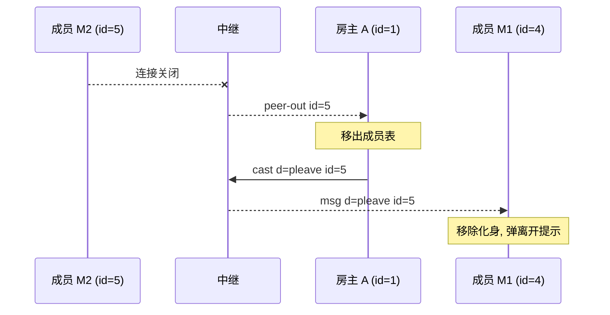

# 场景 08:成员离开 —— close → `peer-out` → `pleave`

成员的 ws 连接关闭(点退出按钮、关标签页、断网被心跳清扫,中继一视同仁)时:

1. 中继把它移出房间成员表,给**房主**发 `{t:'peer-out', id}`(`server/index.js` 的 close 处理);
2. 房主把它移出自己的成员表,并向余下成员广播游戏层的 `{t:'pleave', id}`
   (`public/js/host.js` 的 `handlePeerOut`);
3. 各成员据此移除该玩家的化身并弹"xx 离开了房间"提示(`public/js/main.js` 的 `pleave` 分支)。

## 时序图



## 逐条消息

成员 M2 的连接关闭(无消息,纯 ws close 事件)。

中继 → 房主 A:

```json
{"t":"peer-out","id":5}
```

房主 A → 中继(无 `except`,通知所有余下成员):

```json
{"t":"cast","d":{"t":"pleave","id":5}}
```

中继 → 成员 M1:

```json
{"t":"msg","d":{"t":"pleave","id":5}}
```

### 主动退出按钮

`main.js` 的 `handleExit` 也走这条路:本地同步拆掉游戏会话后 `net.close()`,
对中继和其他玩家来说与断网无异。**房主**点退出则触发场景 07 的迁移,
而不是本场景。

## 信任边界要点

- `peer-out` 只发给房主——中继的房间成员关系只有房主需要知道;
  其他成员的"谁在房里"完全来自房主的游戏层广播(`pjoin`/`pleave`)。
- 成员对 `pleave` 容错:id 不认识(比如重复 `pleave`、或该成员从未 `pjoin` 过)
  就是个无操作(`dropRemote` 查不到即返回),恶意房主乱发 `pleave` 最多让
  化身消失,不会崩溃。
- 中继侧对重复/陈旧 close 免疫:`st.room` 先置空再处理,房间不存在直接返回。
- 离开的成员若是 `cast ... except` 的目标,中继照常把该 cast 广播给所有人
  (`except` 只是回声抑制,不因目标消失而丢整条广播,见 `server/index.js` 注释)。
- 房主断线期间离开的成员,其 `pleave` 会丢失——由迁移时新房主对照 `peers`
  名单补发(见场景 07)。
