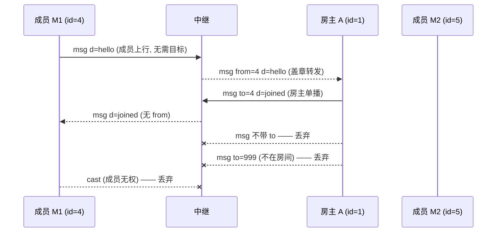

# 场景 09:`msg` 路由规则 —— 成员只达房主;房主必须带 `to`

中继的 `msg` 是一条**星形拓扑**的定向信道(`server/index.js` 的 `msg` 分支):

- **成员**发 `{t:'msg', d}` → 中继转发给**房主**,信封盖上发送者 id:
  `{t:'msg', from:<id>, d}`。成员没有任何办法指定别的目标——`to` 字段被无视。
- **房主**发 `{t:'msg', to:<id>, d}` → 中继转发给那一名成员:`{t:'msg', d}`
  (信封**没有** `from`)。不带 `to`、或 `to` 不在房间,整条消息**静默丢弃**。
- 一对多用 `{t:'cast', d, except?}`,**仅房主可用**(场景 04–07 中大量出现)。

成员之间不存在直连信道:一切都要经房主中转,这正是"权威在房主"的网络形态。

## 时序图



## 逐条消息

### 1. 成员 → 房主(自动路由 + `from` 盖章)

成员 M1 → 中继(以重复 `hello` 为例;任何游戏层载荷同理):

```json
{"t":"msg","d":{"t":"hello","name":"小梅","skin":{"s":2,"p":6}}}
```

中继 → 房主 A:

```json
{"t":"msg","from":4,"d":{"t":"hello","name":"小梅","skin":{"s":2,"p":6}}}
```

### 2. 房主 → 单个成员(必须带 `to`)

房主 A → 中继(重复 hello 的应答:重新单播 `joined`,见场景 04/07):

```json
{"t":"msg","to":4,"d":{"t":"joined","room":"石榴小镇","seed":12345,"id":4,"players":[{"id":1,"name":"阿石","p":[9,33,8],"ry":0.5,"skin":{"s":1,"p":5}},{"id":5,"name":"小树","p":[8,40,8],"ry":0,"skin":{"s":3,"p":0}}],"edits":[[10,30,8,8]]}}
```

中继 → 成员 M1(只有 M1 收到;实测 M2 在 600ms 内无任何消息):

```json
{"t":"msg","d":{"t":"joined","room":"石榴小镇","seed":12345,"id":4,"players":[{"id":1,"name":"阿石","p":[9,33,8],"ry":0.5,"skin":{"s":1,"p":5}},{"id":5,"name":"小树","p":[8,40,8],"ry":0,"skin":{"s":3,"p":0}}],"edits":[[10,30,8,8]]}}
```

### 3. 被丢弃的形态(实测均无任何下行,也无错误回执)

房主 A → 中继,**不带 `to`**(两名成员 600ms 内均无消息):

```json
{"t":"msg","d":{"t":"pmove","id":1,"p":[0,0,0],"ry":0,"rx":0}}
```

房主 A → 中继,`to` 指向不在房间的 id:

```json
{"t":"msg","to":999,"d":{"t":"pleave","id":999}}
```

成员 M1 → 中继,僭越使用 `cast`(房主与 M2 均无消息):

```json
{"t":"cast","d":{"t":"block","x":0,"y":1,"z":0,"id":3}}
```

未绑定连接(从未 host/join)→ 中继,发 `msg`(房主无消息):

```json
{"t":"msg","d":{"t":"hello","name":"黑客"}}
```

## 信任边界要点

- **`from` 由中继按连接盖章**(取自连接自身的 `st.id`),成员伪造不了发送者身份;
  房主端 `host.js` 据 `from` 查成员表,未经 `peer-in` 登记的 id 直接忽略。
- **下行信封没有 `from`**:成员收到的 `{t:'msg', d}` 一律视为"来自当前房主"
  (`network.js` 把 `from` 解析为 `null` 交给 `onMsg`)。房主迁移后这一语义
  自动指向新房主,成员代码零修改。
- **`cast` 是房主专属能力**:中继检查 `st.role !== 'host'` 即丢弃,成员无法广播。
  (唯一的例外路径:中继在发 `promote` 之前已把被提升者的角色翻成 host,
  所以新房主的第一条 `resync` cast 不会被拒,见场景 07。)
- 所有非法路由都是**静默丢弃**,没有错误回执——探测不到房间内部结构。
- 中继从不解析 `d`:路由只看信封(`t`/`to`/`except`),载荷对它是黑盒,
  双方客户端必须各自校验内容(场景 04–07 的清洗规则)。
