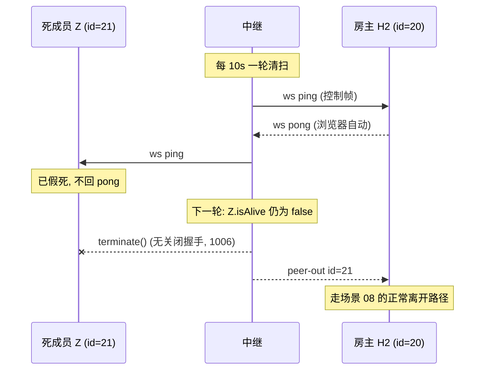

# 场景 10:心跳活性 —— 10s ping/pong,死连接 terminate

没有心跳,一个不体面死亡的连接(Wi-Fi 掉线、手机锁屏断电)在 OS 的 TCP 超时前
会一直显示 OPEN——若死的是房主,整个房间会僵上几分钟。中继的清扫机制
(`server/index.js`,`HEARTBEAT_MS = 10_000`):

- 每 10 秒一轮:把每个连接的 `isAlive` 置为 `false`,随后发 ws 协议层 **ping**(控制帧,非 JSON);
- 收到 **pong** 的连接把 `isAlive` 翻回 `true`(浏览器对协议层 ping 自动应答,无需任何客户端代码);
- 下一轮扫到 `isAlive === false`(上轮 ping 没回 pong)的连接,直接 `terminate()`。

`terminate()` 会触发该连接的 close 事件,所以死连接走的是与正常关闭**完全相同**的
善后路径:死成员 → 场景 08(`peer-out` → `pleave`);死房主 → 场景 07(迁移)。
最坏检测延迟约两个心跳周期(~20 秒)。

(host.js 的"禁用定时器"规则只约束房主标签页;服务器用 `setInterval` 是允许的。)

## 时序图



## 实测时间线

抓取方式:成员 Z 以 `autoPong: false` 建立连接(拒绝应答一切 ping),加入房主 H2 的房间。
时间为相对服务器启动的秒数:

```text
[  6.989s] Z 加入房间 (accepted), H2 收到 peer-in id=21
[ 10.165s] 中继 → 所有连接 : ws ping 控制帧   ← 第一轮清扫, Z 不回 pong
[ 20.176s] 第二轮清扫: Z.isAlive 仍为 false → terminate()
[ 20.177s] Z 的连接关闭 (close code 1006, 无关闭握手)
[ 20.177s] 中继 → H2 : {"t":"peer-out","id":21}
```

逐条 JSON(本场景里唯一的 JSON 帧——ping/pong 是 ws 控制帧,不是 JSON 消息):

中继 → 房主 H2:

```json
{"t":"peer-out","id":21}
```

此后房主照常 `cast` `{t:'pleave', id:21}`(场景 08)。若假死的是**房主**,
同一次 `terminate()` 触发的 close 会走场景 07:提升最老成员、`promote` + `newhost`、
重发 `hello`、`resync`——对游戏层来说,死亡方式完全透明。

## 信任边界要点

- **活性检测是中继的职责**:客户端零代码参与(浏览器在协议层自动回 pong),
  `public/js/network.js` 里找不到任何心跳逻辑——这是刻意的,客户端无法"忘记"心跳。
- **心跳只证明 TCP/ws 层活着,不证明应用层活着**:一个标签页假死但内核还在回 pong
  的房主,中继查不出来。这一层由客户端的应答期限兜底——`public/js/main.js` 给
  join/host/list 各设约 10 秒回复期限(`armReplyTimer`/`armLobbyTimer`),
  到期主动 `net.close()` 自救,不至于让菜单僵死。
- `terminate()` 不做关闭握手(对端观察到 close code 1006),但服务器侧的 close
  处理与体面关闭共用同一段代码——不存在"心跳专用"的旁路状态,少一类边界 bug。
- 清扫是全连接一视同仁的(包括未绑定的大厅连接),空闲连接不能无限占用文件描述符。
