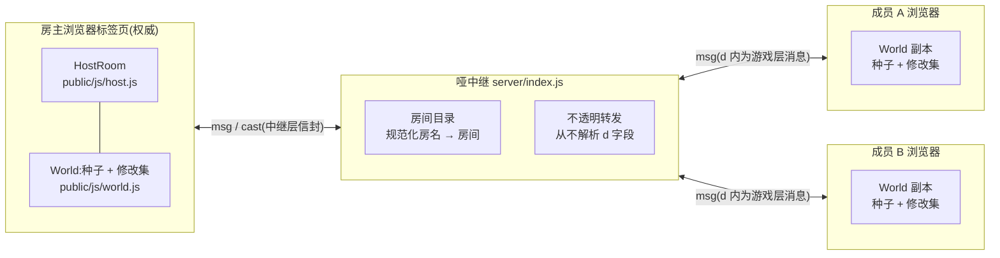
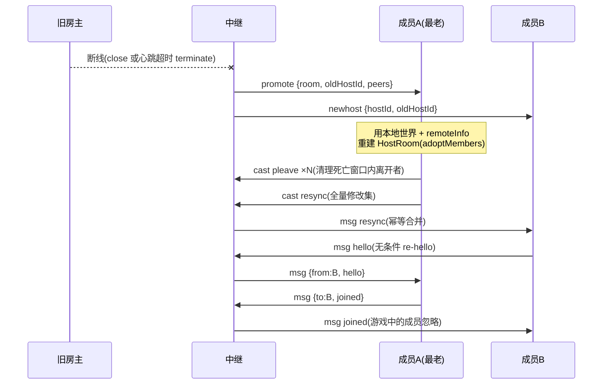

# VoxelCraft 白皮书

> 一个跑在浏览器里的跨平台体素沙盒联机游戏:服务器只是"哑中继",真正的房间权威逻辑运行在房主的浏览器标签页中。
>
> 本文面向第一次接触本项目的读者。所有协议字段、错误码与数值上限均核对自仓库源码(出处标注在各节中);架构契约的原始定义见 `DESIGN.md`。

---

## 1. 愿景与设计目标

VoxelCraft 要解决的第一需求很朴素:**一台电脑、几部手机,连同一个 Wi-Fi,打开浏览器就能进同一个房间一起玩**。PC、安卓、iPhone 全部通过浏览器参与,无需安装(安卓另有可选的 App 壳,见第 9 章)。

由此推导出几条设计原则:

- **架构优先于内容。** 当前的游戏内容(8 种方块、无生物、无合成)是占位性质的,作者计划后续重做内容层。因此本项目的价值沉淀在网络架构、协议与信任模型上,而不是玩法数值里。
- **任何人都能在自己电脑上开服。** `npm start` 即起一个完整服务器(静态文件 + WebSocket 中继,见 `server/index.js`)。没有数据库、没有外部服务、唯一的 npm 运行依赖是 `ws`(见 `package.json`)。
- **公共中继退化为"廉价目录 + 字节转发"。** 把这套代码部署到任何一台有公网地址的便宜机器上,它就成了所有人的房间目录;但它**不运行任何游戏逻辑**,负载与房间内发生的事情几乎无关。游戏逻辑的算力由房主自己的浏览器出。
- **零构建、零外部网络资源。** 纯 ES modules 直接被浏览器加载,three.js 内置于 `public/lib/`,不依赖 CDN 和外部字体——局域网里没有外网的手机也能玩(`DESIGN.md` 硬性规则)。

## 2. 总体架构:哑中继 + 房主浏览器权威

v2 架构采用类似 HaxBall 的"玩家托管"模式:

- **中继(`server/index.js`)**:游戏无关。它只懂两件事——维护"房间名 → 房间"的目录,以及在房主与成员之间转发字节。游戏数据封在消息的 `d` 字段里,**中继从不解析 `d`**,转发时只重新序列化信封本身。
- **房主(`public/js/host.js` 的 `HostRoom`)**:谁创建房间,谁的浏览器标签页就是该房间的权威服务器。成员的所有游戏消息经中继转发给房主,由房主校验、应用、再广播。
- **成员(`public/js/main.js` + `public/js/network.js`)**:持有完整的本地世界副本(种子 + 全部修改记录),渲染与物理都在本地跑,网络上只交换"方块修改"和"玩家位置"。

这个分层带来三个直接收益:

1. **中继极廉价**:无游戏状态(没有种子、没有修改集、没有坐标),一台最低配的云主机就能服务大量房间。
2. **房间不因房主掉线而死**:每个客户端都持有全量世界,中继可以把"最老的成员"原地提升为新房主(第 7 章)。
3. **协议自然分两层**:中继层(第 3 章)是稳定的基础设施协议;游戏层(第 4 章)封在 `d` 里,可以随内容重做而演进,中继无需改动。

## 3. 中继层协议规范

载体:WebSocket 上的 JSON 文本帧,路径 `/ws`。以下全部细节出自 `server/index.js`,客户端封装见 `public/js/network.js`(`RelayNet`)。

### 3.1 连接与身份

- 每个连接获得一个**整数 id**,每次服务器运行从 1 起自增(`nextId`)。
- 连接初始为"未绑定"状态;发送 `host` 或 `join` 成功后绑定为该房间的 `host` 或 `member` 角色。已绑定的连接再次发送 `host`/`join` 会被**静默忽略**。
- 未绑定连接可发 `host`/`join`(完成绑定)与 `list`;其 `msg`/`cast` 一律被静默忽略。

### 3.2 房名规范化(房间名即房间身份)

房间没有随机房号,**用户起的名字就是房间的唯一标识**(完整 Unicode,中文原生支持)。服务器端对 `host` 与 `join` 的房名统一做规范化(`normalizeRoomName`):

1. `String(x).normalize('NFC')`;
2. `trim()` 去首尾空白;
3. 内部连续空白折叠为单个空格(`replace(/\s+/g, ' ')`);
4. 规范化后必须为 **1–16 个码点**(按码点计数,不是 UTF-16 单元),否则回复 `{t:'error', code:'bad-name'}`。

查找键 = 规范化名 `.toLowerCase()`(大小写不敏感);房间的**显示名**保留创建者输入的规范化形式。

### 3.3 上行消息(客户端 → 中继)

| 消息 | 字段 | 语义 |
|---|---|---|
| `{t:'host', room, public?, meta?}` | `room` 房名;`public` 缺省 `true`;`meta` 任意 JSON | 创建房间并成为房主。键已存在 → `error: taken`。`meta` 对中继完全不透明:仅存储并在房间列表中回显;若其 JSON 序列化超过 **256 字符**(或不可序列化)则存为 `null`。成功回复 `{t:'hosted', room:<显示名>, id}` |
| `{t:'join', room}` | `room` 房名 | 按规范化键查房加入。成功回复 `{t:'accepted', id, hostId}`,同时房主收到 `{t:'peer-in', id}`。错误:`no-room` / `full` / `bad-name` |
| `{t:'list'}` | 无 | 任何连接(含未绑定)可发。回复 `{t:'rooms', rooms:[{room, players, meta}]}`——**仅公开房间**,`players = members.size + 1`,按创建时间最新在前,**上限 50 条** |
| `{t:'msg', d}`(成员) | `d` 不透明 | 转发给房主,房主收到 `{t:'msg', from:<成员id>, d}` |
| `{t:'msg', to, d}`(房主) | `to` 成员 id | 转发给该成员,成员收到 `{t:'msg', d}`。`to` 不在房内 → 静默忽略 |
| `{t:'cast', d, except?}`(房主) | `except` 可选成员 id | 广播 `{t:'msg', d}` 给除 `except` 外的所有成员。每个载荷只 `JSON.stringify` 一次。**若 `except` 指向的 id 已离开房间,则广播给所有成员**——`except` 仅用于回声抑制,发起者已离场时绝不能丢弃整条广播 |

### 3.4 下行消息(中继 → 客户端)

| 消息 | 接收方 | 语义 |
|---|---|---|
| `{t:'hosted', room, id}` | 房主 | 建房成功,`room` 为显示名 |
| `{t:'accepted', id, hostId}` | 成员 | 入房成功 |
| `{t:'rooms', rooms}` | 任意 | 公开房间列表 |
| `{t:'error', code}` | 请求方 | 见 3.5 错误码 |
| `{t:'msg', from?, d}` | 房主/成员 | 转发的游戏载荷(房主侧带 `from`) |
| `{t:'peer-in', id}` | 房主 | 有成员加入 |
| `{t:'peer-out', id}` | 房主 | 有成员断开 |
| `{t:'promote', room, oldHostId, peers}` | 被提升的成员 | 房主迁移:你已成为新房主,`peers` 为其余成员 id 列表 |
| `{t:'newhost', hostId, oldHostId}` | 其余成员 | 房主迁移:`hostId` 接任 |

### 3.5 错误码

| 错误码 | 触发条件 |
|---|---|
| `bad-name` | `host`/`join` 的房名规范化后不在 1–16 码点内 |
| `taken` | `host` 时规范化键已存在 |
| `no-room` | `join` 时房间不存在(客户端把它当作"可创建"的正常分支,见 6.3) |
| `full` | `join` 时房间已满 |

### 3.6 容量、载荷上限与活性

- **房间容量 8**:`ROOM_CAPACITY = 8`,即房主 + 7 名成员;`join` 在 `members.size >= 7` 时拒绝。
- **maxPayload 64 KB**:`WebSocketServer` 以 `maxPayload: 64 * 1024` 构造,超限帧由 ws 自动以代码 1009 断开连接——未认证客户端无法把约 100 MB 的帧(ws 默认上限)推进共享中继的解析/重序列化路径;64 KB 仍足以容纳现实规模的 `joined`/`resync` 修改列表。
- **心跳 10 秒**:中继每 `10_000` ms 对所有连接发 WebSocket ping,错过一次 pong 即 `terminate()`。这保证非正常死亡的房主(断 Wi-Fi、断电)在秒级触发迁移,而不是等操作系统的 TCP 超时拖几分钟。浏览器对协议层 ping 自动回应,客户端无需写任何代码。("禁用定时器"规则只约束 `host.js`,不约束服务器。)
- **健壮性**:畸形 JSON、缺失/非字符串 `t`、未知 `t`、未绑定连接发的游戏消息、`to` 不在房内的 `msg`——一律静默忽略,绝不崩溃。

### 3.7 静态文件服务(同一进程)

中继进程同时静态托管 `public/`(`/` 返回 `index.html`):仅允许 GET/HEAD(否则 405),路径解析后必须落在 `public/` 内(防目录穿越),按扩展名给 Content-Type(`.html .js .css .png .json .apk`),其余 404。端口 `process.env.PORT || 8080`,监听 `0.0.0.0`,启动时打印全部局域网 IPv4 地址。

## 4. 游戏层协议(`d` 字段内)

游戏层消息只在客户端之间有意义,经由中继的 `msg`/`cast` 信封不透明传输。权威端是房主(`public/js/host.js`),成员端处理在 `public/js/main.js` 的 `memberOnMsg`。

### 4.1 成员 → 房主(上行)

| 消息 | 字段 | 语义与校验(`public/js/host.js`) |
|---|---|---|
| `{t:'hello', name, skin}` | `skin = {s, p}` | 收到 `accepted` 后立即发送。房主校验:`name` 必须是字符串,trim 后截 16 字符,空则置 `'玩家'`;`skin.s`/`skin.p` 必须是 `0..7` 整数,否则坍缩为 `{s:0, p:0}`。重复 hello → 仅重发 `joined`,绝不重播 `pjoin`(迁移后的 re-hello 依赖此幂等性,见第 7 章) |
| `{t:'move', p:[x,y,z], ry, rx}` | 脚底坐标、偏航、俯仰 | 发送频率 ≤ 12 Hz(节流在 `public/js/main.js`,`MOVE_INTERVAL = 1000/12`)。房主校验三元有限数组与有限 `ry`/`rx`;hello 之前的 move 一律忽略 |
| `{t:'block', x, y, z, id}` | `id = 0` 表示破坏 | 房主校验:四个字段都是整数,`0 <= id <= MAX_BLOCK_ID`(由 `BLOCK` 常量推导,当前为 8),`0 <= y < HEIGHT(64)`;不合法直接丢弃 |

### 4.2 房主 → 成员(下行)

| 消息 | 字段 | 语义 |
|---|---|---|
| `{t:'joined', room, seed, id, players, edits}` | `players:[{id,name,p,ry,skin}]`,`edits:[[x,y,z,id],…]` | 对 `hello` 的单播应答。`id` 为收件人自己的中继 id;`players` 包含房主本人(取自实时 `playerRef`)与其他已 hello 成员、不含收件人;`edits` 序列化自房主的 `world.edits` 全量修改集 |
| `{t:'pjoin', id, name, p, ry, skin}` | — | 成员的 hello 被接受后,广播给其他人 |
| `{t:'pmove', id, p, ry, rx}` | — | 成员移动的转播,以及房主自己的移动(房主盖上自己的 id)。**带 `except` 排除发送者** |
| `{t:'pleave', id}` | — | 收到 `peer-out` 后广播 |
| `{t:'block', x, y, z, id}` | — | 见 4.3 |
| `{t:'resync', edits}` | 与 `joined.edits` 同构 | 房主迁移后,新房主广播自己的全量修改集(第 7 章) |

### 4.3 block 的"回声式"广播:为什么发起者也收一份

`pmove` 排除发送者,而 `block` **广播给所有人、包括发起编辑的那个成员**(`host.js` 的 `handleMsg('block')` 与 `castOwnBlock` 均不带 `except`)。流程是:

1. 成员本地先行应用编辑(乐观),并上行 `block`;
2. 房主校验后 `world.applyEdit(x,y,z,id)` 应用到**自己的权威世界**;
3. 房主把权威结果原样广播给**全员**。

理由:当两名成员几乎同时编辑**同一格**时,各自的乐观应用结果是相互矛盾的。回声保证每个人(包括两个发起者)最终都按"到达房主的顺序"重放同一串权威编辑——`world.applyEdit` 是幂等的(对 `Map` 键的最后写入),重放自己的编辑无副作用,于是同格冲突**收敛**到房主侧的到达顺序,而不是各端永久分叉。位置消息不需要这一手:下一帧的 `pmove` 自然覆盖旧值,位置是自愈的;方块是离散持久状态,只有回声能保证收敛。

成员侧收到 `block`/`resync` 时镜像房主的校验(整数、`y`/`id` 范围,见 `public/js/main.js`),不合法条目直接跳过——因为成员的修改集将来可能因迁移而成为权威,绝不能被污染。

## 5. 世界模型:种子 + 修改集

世界状态 = **一个整数种子 + 一份修改集**(`Map<"x,y,z", id>`),实现见 `public/js/world.js` 与 `public/js/terrain.js`。

- **确定性生成**:`makeGenerator(seed)` 由两个种子化的 simplex 噪声实例算列高(`heightAt`,夹在 [4,50]),柱状填充石头/泥土/草(高度 ≤ 21 时为沙滩),树由 `hash2(x,z,seed)` 确定性放置,并在生成区块时扫描边界外 2 格的"边距",保证**同一棵树从任何相邻区块生成都得到完全相同的方块**。同种子在任何设备、任何时刻生成的地形逐方块一致。
- **修改集是唯一的真相增量**:`setBlock`/`applyEdit` 把每次编辑写入 `world.edits`,并维护按区块索引的副本(`_editsByChunk`),区块按需生成时(`ensureChunk`)只重放落在该区块内的修改。网络上**从不传输区块数据**——只传种子(一次)和修改(逐条)。
- **房主选种**:创建房间时由房主随机选取 `Math.floor(Math.random() * 2**31)`(`public/js/main.js` 的 `onHosted`)。

这套表示让两件昂贵的事变得廉价:

1. **后加入者**:一条 `joined` 消息(种子 + 全量修改数组)就是完整世界,本地照常生成地形再重放修改即可,看到此前所有人的全部改动。
2. **房主迁移**:每个成员手里**本来就有**与房主等价的世界(同种子 + 同修改集,靠 block 回声保持同步),提升任何一个成员为新权威都不需要传输世界——只需对齐成员名单并广播一次 `resync` 兜底(第 7 章)。

## 6. 身份与人物系统

### 6.1 房间名即身份

本项目没有账号系统。**房间的身份就是它的名字**(规范化规则见 3.2),知道名字就能进(私密房不出现在列表里,名字即口令);玩家的身份就是其人物名,纯客户端概念。

### 6.2 人物与 PALETTE

人物 = `{name, skin:{s, p}}`,其中 `s`(上衣)与 `p`(裤子)是 `public/js/constants.js` 导出的 `PALETTE`(恰好 8 个十六进制颜色)的索引;头部固定肤色,不参与定制。协议上只传 `{name, skin}`;任何越界/畸形 skin 在房主端与成员端都坍缩为 `{s:0, p:0}`。一个浏览器可建多个人物、随时切换,外观对所有玩家可见。

### 6.3 localStorage 键名(均由 `public/js/ui.js` 管理,读写包 try/catch)

| 键 | 内容 |
|---|---|
| `vc-chars` | 人物数组 `[{name, skin:{s,p}}]` |
| `vc-active` | 活动人物的下标 |
| `vc-server` | 上次使用的服务器地址(空 = 同源) |
| `vc-history` | "我的足迹"房间历史 `[{room, host, t}]`,最新在前、按客户端镜像的规范化键去重、**上限 20 条**;`host` 一旦为 true 永久保持(自己创建过的房间在列表中金色高亮) |
| `vc-name` | v1 遗留键,仅用于全新安装时预填人物名 |

另支持 URL 参数 `?room=<房名>` 预填房名输入框。房名输入框留空时,客户端生成随机中文房名(形容词 + 地点 + 两位数,如"迷雾森林42",词池见 `public/js/ui.js`)并走一遍正常的"先找后建"流程:`join` 得到 `no-room` → 对这个一次性生成名跳过确认直接创建;若撞名则顺势加入。

### 6.4 meta 约定

建房时客户端在 `meta` 里放 `{n: <房主人物名,≤24 字符>}`(`public/js/main.js`)。这是**纯客户端约定**:中继只存储与回显(序列化 ≤ 256 字符,见 3.3),永不解析;当前版本的客户端也不消费 meta——`onRooms` 在渲染前即丢弃它(预留给未来字段,见 `DESIGN.md`),被渲染的列表内容(房名、人数)一律以 textContent 呈现。

## 7. 房主迁移与收敛

### 7.1 全流程

逐步说明(中继侧 `server/index.js`,客户端侧 `public/js/main.js` 的 `handlePromote`/`handleNewHost`):

1. **中继提升最老成员**。`members` 是 `Map`,插入顺序即加入顺序,取第一个条目提升:其角色翻转为 host,收到 `{t:'promote', room, oldHostId, peers}`;其余成员收到 `{t:'newhost', hostId, oldHostId}`。无成员剩余则删除房间。房间名不变,所有 id 跨迁移稳定。
2. **新房主从本地状态重建权威**。世界(种子 + 修改集)本来就在本地;成员名单从自己跟踪的 `remoteInfo` 过滤到 `peers` 后 `adoptMembers`(其中名字/皮肤再过一遍清洗——继承自恶意旧房主的脏数据不得二次广播);`peers` 中自己从未见过的 id 注册为待 hello 的 pending 成员。
3. **清理死亡窗口**。`peers` 是中继的权威名单:本地跟踪却不在 `peers` 里的玩家是在旧房主死亡窗口内离开的(其 `pleave` 随旧房主丢失)——逐个剔除并代为广播 `pleave`,让其他幸存成员同步愈合。
4. **广播 `resync`**。新房主把自己的全量修改集广播给全员;成员逐条校验后用幂等的 `world.applyEdit` 合并。死亡窗口内旧房主见过而新房主没见过的编辑会被丢弃——**新房主状态获胜**,这正是未来加入者将看到的状态,全房由此收敛于单一权威。
5. **成员无条件 re-hello**。收到 `newhost` 的成员(无论是否已在游戏中)向新房主重发 `hello`。两种窗口都靠它闭合:(a) 正在加入途中,原 hello 随旧房主死亡,`joined` 永远不会来;(b) 已在游戏中但新房主从未见过它的 hello,它在新房主侧是"幽灵成员"——re-hello 触发新房主向其他人 `pjoin` 公告。hello 幂等(4.1),已知成员只会收到一次被忽略的 `joined` 重发。
6. **已接受的边界情况**:一个还没收到 `joined` 就被提升的成员没有世界、无法当房主——它主动断开,让中继提升下一位。

### 7.2 为什么 host.js 禁用定时器

`public/js/host.js` 严格事件驱动,**禁止 setInterval/setTimeout/rAF**(`DESIGN.md` 硬性规则)。原因:浏览器对**后台标签页**大幅节流定时器与 rAF(分钟级),但 **WebSocket 消息回调照常触发**。房主把游戏页切到后台是常态(尤其手机),若权威逻辑依赖任何定时器,后台房主就会冻结整个房间;而纯靠 ws 事件驱动的 `HostRoom` 在后台标签里依然能即时校验、应用、广播每条成员消息。(代价是后台房主自己的化身不再移动——rAF 停了——但这无关紧要。)同理,中继的 10 秒心跳放在服务器侧而非房主侧。手机房主在游戏中还会申请屏幕 wake lock(`public/js/main.js`)以推迟锁屏;真锁了屏则走正常迁移。

## 8. 信任与安全模型

三方互不信任:**中继**是可能被任意客户端滥用的公共设施;**房主**只是另一个玩家的浏览器,可能恶意;**成员**同样可能恶意。校验必须双向、在每个边界各自落地。

### 8.1 双向校验清单(已落地)

**中继不信任任何客户端**(`server/index.js`):
- `maxPayload: 64 KB`,超限帧直接断连(1009);
- 从不解析 `d`,转发只重序列化信封——客户端无法用畸形游戏载荷打击中继;
- 房名服务器侧规范化 + 1–16 码点校验;meta 序列化 > 256 字符即弃存;房间列表上限 50 条;容量 8 硬上限;
- 角色绑定状态机(已绑定忽略再次 `host`/`join`;未绑定连接的 `msg`/`cast` 被忽略);畸形 JSON/未知 `t` 一律静默忽略;
- 静态服务防目录穿越、仅 GET/HEAD;
- 10 秒 ping/pong 清扫半死连接。

**房主不信任成员**(`public/js/host.js`):
- 没有 `peer-in` 记录的 id 的消息一律忽略;hello 之前的 `move`/`block` 一律忽略;
- `cleanName`(字符串、trim、截 16、空补默认)与 `cleanSkin`(0..7 整数对,否则坍缩);
- `move` 校验有限数三元组与有限角度;`block` 校验整数、`id`/`y` 范围(`MAX_BLOCK_ID` 由 `BLOCK` 推导,加块不会脱钩);
- 迁移时 `adoptMembers` 对继承数据再清洗一遍。

**成员不信任房主**(房主就是个陌生玩家的浏览器,`public/js/main.js`):
- `joined` 全shape校验(房名镜像中继的 1–16 码点规则——它会进 `vc-history` 并被渲染;players 坐标必须有限;edits 逐条过滤),畸形载荷直接忽略,绝不在 hideMenu 之后崩死标签页;
- `block`/`resync` 镜像房主侧的整数与范围校验——成员的修改集可能因提升而成为权威,必须保持干净;
- `pjoin`/`pmove` 的名字截断、skin 坍缩、`ry` 有限性检查(NaN 会永久污染化身矩阵);重复 `joined` 不会启动第二个游戏循环;
- 房间列表当作攻击者可控:条目过滤非对象;meta 当前不被消费(`onRooms` 渲染前即丢弃,预留字段,见 6.4);被渲染的列表内容(房名、人数)一律 textContent、绝不 innerHTML(`public/js/ui.js`);
- `world._set` 拒绝非有限坐标(NaN 键污染修改集)。

**结构性加固**(横跨三方):
- block 回声收敛(4.3)与迁移后 `resync`(7.1)保证状态最终一致;
- 无条件 re-hello 闭合幽灵成员窗口(7.1);
- 所有等待中继应答的大厅请求(`join`/`host`/`list`)都有 ~10 秒回复超时,超时即 `net.close()` 走统一恢复路径——半开 socket 或恶意房主吞掉 hello 都不能把菜单卡死几分钟(`public/js/main.js`);
- `cast` 的 `except` 容错:发起者已离场时广播全员而不是丢弃(3.3)。

### 8.2 B 类待补清单 —— 公网长期开放前必须补

以下风险**已知且尚未实现缓解**,当前形态适合局域网与小圈子临时公网;把中继长期开放到公网之前必须逐项补齐:

| # | 风险 | 现状 |
|---|---|---|
| 1 | **限流**:单连接消息频率/字节速率无任何限制,可对中继与房主刷洪水(64 KB 上限只限单帧大小,不限帧频) | 未实现 |
| 2 | **每 IP 连接数与房间数上限**:一个 IP 可开任意多连接、创建任意多房间,耗尽目录与文件描述符 | 未实现 |
| 3 | **防房名占位**:建房无需任何凭据,先到先得;脚本可批量抢注热门名字且零成本永久占用(连接不断即不释放) | 未实现 |
| 4 | **零宽字符/同形字房名**:NFC 规范化不会去除零宽字符,也不处理同形异码字——攻击者可造出肉眼与热门房间无法区分的"假房间"钓鱼 | 未实现(仅做 NFC + 空白折叠) |
| 5 | **房主编辑日志无上限**:`world.edits` 只增不减,`joined`/`resync` 载荷随之线性增长;长寿房间最终会撞上中继 64 KB 的 maxPayload——届时房主的上行帧被 1009 断开,房间陷入迁移循环。需要编辑合并/压缩或分片同步 | 未实现 |
| 6 | **成员越权放块**:没有权限/区域保护/速率概念,任何完成 hello 的成员可以以任意速度修改世界任何位置(仅 `y=0` 层与范围校验例外)——恶意成员可瞬间夷平全图 | 未实现 |

另见 README 的建议:公网部署应考虑房间密码(名字即口令对私密房只是弱保护)。

## 9. 跨平台工程

- **纯 ES modules、零构建**:客户端没有框架、打包器与 TypeScript,`public/js/` 下的模块被浏览器直接加载;改完代码刷新即生效。
- **three.js 内置**:r184 以双文件形式 vendored 在 `public/lib/three.module.js` + `public/lib/three.core.js`(版本核对自 `three.core.js` 的 `REVISION = '184'`)。无 CDN、无外部字体——断外网的局域网手机照常游玩。
- **安卓 App 壳(Capacitor 8)**:`@capacitor/* ^8.4.0`(`package.json`),工程在 `android/`。`tools/build-apk.ps1 [-DefaultServer "地址"]` 打出 `public/VoxelCraft.apk`——APK 被放回 `public/`,手机直接从游戏服务器下载安装。`-DefaultServer` 把默认中继地址烤入 App 内的 `app-config.js`(`window.VC_DEFAULT_SERVER`);菜单里的服务器输入框随时可改并持久于 `vc-server`,所以**换中继不用重装 App**。网页版的 `public/app-config.js` 为空。
- **服务器地址归一化**:`relayUrl`(`public/js/network.js`)把用户输入归一为 ws URL——空 = 同源(页面由中继本身托管,https 页自动用 wss);裸 `host:port` 视为局域网风格的 `ws://`;裸域名(无端口)视为隧道/云风格的 `wss://`;显式 scheme 优先。
- **快速公网隧道**:`cloudflared tunnel --url http://localhost:8080` 即得一个临时 `https://*.trycloudflare.com` 入口(README;域名每次重启更换,适合测试)。cloudflared 不随仓库分发,需自行从官方渠道下载,见部署场景 `docs/scenarios/deployment/02-tunnel.md`。
- **触屏与桌面双输入**(`public/js/controls-touch.js` / `controls-desktop.js`):触屏——屏幕左 40% 起手的触摸为虚拟摇杆(死区 0.15),其余区域拖动转视角(0.005 rad/px),**快速点按(<250 ms)= 放方块,按住 400 ms 不动 = 挖方块**(触发时振动 40 ms);所有触摸监听 `{passive:false}` + `preventDefault`(iOS 必需)。桌面——点击画布请求指针锁,WASD/空格移动跳跃,左/右键挖/放,数字键 1–8 与滚轮选方块。
- **移动端预算**:触屏设备视距半径 3 区块、桌面 4;每帧最多生成 2 个新区块、重建 2 个网格(`public/js/main.js`)。
- **测试工具**:`tools/relay-test.js` 在端口 18097 拉起中继子进程,用裸 ws 客户端逐条断言中继层契约;`tools/host-bot.js` / `tools/member-bot.js` 模拟房主/成员做联调。

## 10. 已知限制与路线图

**当前限制:**

- **无持久化存档**。世界活在玩家们的浏览器内存里;迁移链断尽(所有人离开)后房间与世界一并消失。
- **修改集只增不减**(见 8.2 第 5 条),超长寿房间存在硬上限。
- **手机当房主可行但脆弱**:wake lock 能推迟锁屏,真锁屏即冻结并触发迁移;长期房主建议用电脑。
- **公网延迟不可控**:trycloudflare 临时隧道走境外节点;长期方案是把本项目原样部署到一台有公网地址的服务器上。
- **内容是占位的**:8 种方块,无生物、无合成、无水——内容层留待重做,这正是"架构 > 内容"的取舍。

**路线图(方向性,非承诺):**

- **WebRTC DataChannel 优化层**:中继兜底、P2P 直连优先,把房主—成员流量从中继上卸载并降低延迟(协议分层已为此预留——游戏层不关心传输是中继还是直连)。
- **bun 单文件独立服**:把中继打成单个可执行文件,进一步降低"任何人开服"的门槛。
- **存档与世界持久化**:把"种子 + 修改集"落盘/导出,房间可以休眠与复活。
- **公网加固**:落实 8.2 的 B 类清单,加房间密码。

---

*本文与代码同库维护;当本文与 `DESIGN.md` 或源码冲突时,以 `DESIGN.md`(契约)与源码(事实)为准。*
